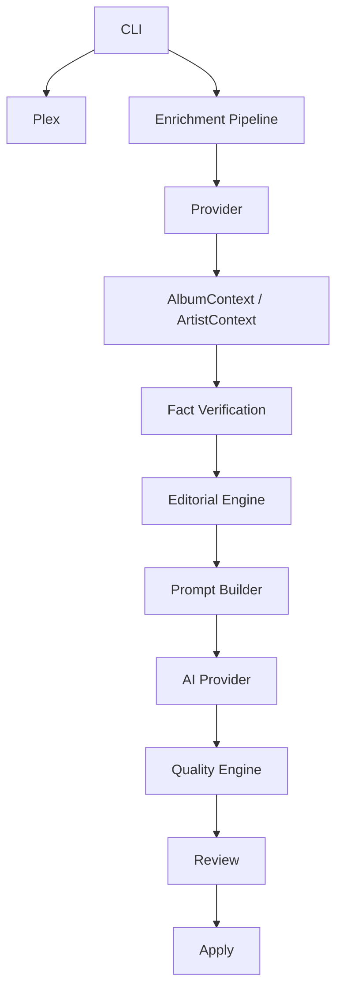
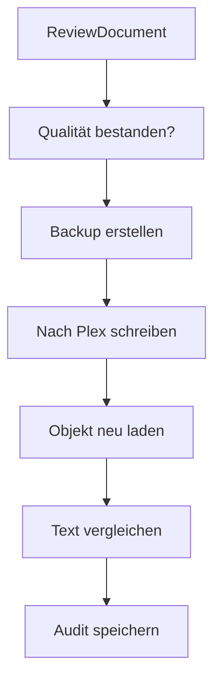
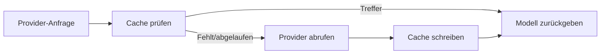
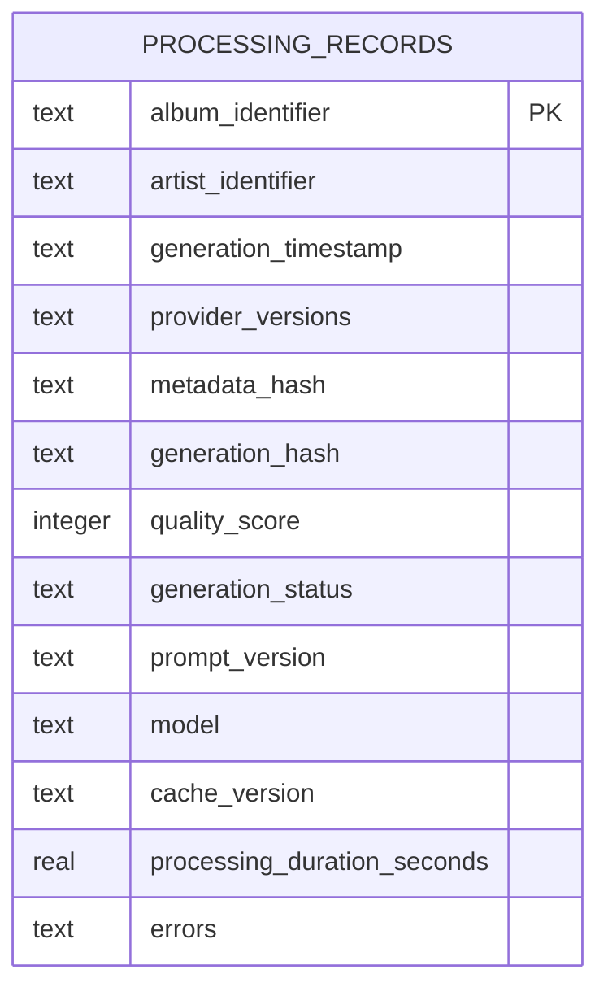

# Architektur

Diese Seite erklärt die Projektstruktur und die wichtigsten Abläufe von Plex Music Enhancer.

## Überblick



## Projektstruktur

```text
src/plex_music_enhancer/
    ai/
    apply/
    batch/
    cache/
    editorial/
    enrichment/
    knowledge/
    library/
    performance/
    plex/
    prompts/
    providers/
    quality/
    review/
    services/
    translation/
    verification/
```

## `cli.py`

Definiert die öffentlichen Befehle. Die CLI ist für Eingaben, Ausgaben, Exit-Codes und Fehlertexte verantwortlich. Fachlogik liegt in Services.

## `plex/`

Enthält Plex-Integration:

- Scannen
- Audit
- Inspect
- Capabilities
- Probe
- Plex Client

Plex-Schreibzugriffe sind streng begrenzt.

## `providers/`

Metadatenquellen:

- MusicBrainz
- Wikipedia
- Discogs
- Last.fm

Provider sind lesend und sollen Fehler isolieren.

## `enrichment/`

Baut `AlbumContext` und `ArtistContext`.

Aufgaben:

- Plex-Objekt finden
- MusicBrainz-Match ausführen
- Providerdaten sammeln
- Kontext zusammenführen
- Validierung vorbereiten

## `verification/`

Bewertet Fakten:

- verifiziert
- wahrscheinlich
- schwach
- widersprüchlich
- unbekannt

## `editorial/`

Bereitet Schreiblogik vor:

- wichtige Fakten
- Story-Reihenfolge
- fehlende Themen
- Stilhinweise

Diese Schicht erzeugt selbst keine endgültige Prosa.

## `prompts/`

Lädt und rendert Markdown-Prompts.

Promptdateien liegen im Projektordner:

```text
prompts/
```

## `ai/`

Provider-unabhängige AI-Abstraktion.

Implementiert:

- `dummy`
- `openai`

Reserviert:

- `ollama`

## `quality/`

Deterministische Qualitätsprüfung nach der Texterzeugung.

Prüft:

- Faktenabdeckung
- Lesbarkeit
- Sprache
- Struktur
- Stil
- Formatierung

## `review/`

Erstellt Review-Dokumente, Diffs und interaktive Prüfungen.

## `apply/`

Sicherer Schreibworkflow:



## `batch/`

Interaktive Verarbeitung mehrerer Alben. Speichert Fortschritt unter:

```text
exports/jobs/
```

## `library/`

Vollständige Bibliotheksworkflows:

- plan
- review
- resume
- apply
- report

## `cache/`

Lokaler Knowledge Cache unter:

```text
~/.plex-enhancer/cache/
```

## `performance/`

Skalierungsfunktionen:

- ProviderScheduler
- Retry
- Metrics
- Benchmark
- SQLite Processing Database
- inkrementelle Fingerprints

## Cache-Architektur



## SQLite-Verarbeitungsdatenbank



## Teststruktur

```text
tests/
```

Tests verwenden Fakes und gemockte HTTP-Antworten. Unit-Tests sollen keine echten externen Dienste aufrufen.

