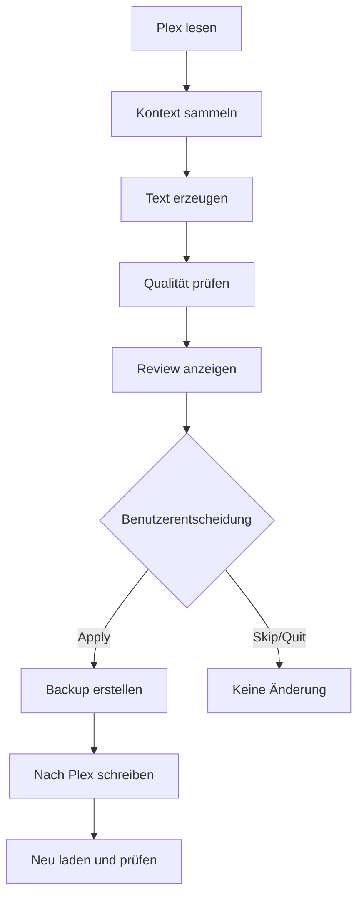

# 1. Einleitung

Plex Music Enhancer ist ein Kommandozeilenwerkzeug für die Pflege von Musikmetadaten in Plex. Es liest bestehende Plex-Informationen, ergänzt sie mit externen Quellen und erzeugt daraus deutsche, sachliche und stilistisch konsistente Album- und Künstlertexte.

## 1.1 Welche Probleme löst das Programm?

Typische Musikbibliotheken enthalten:

- Alben ohne Beschreibung
- englische Zusammenfassungen
- maschinell klingende Übersetzungen
- uneinheitliche Schreibweise
- fehlende Quelleninformationen
- zu kurze oder werbliche Texte

Plex Music Enhancer löst diese Probleme nicht durch blindes Überschreiben, sondern durch einen kontrollierten Prozess aus Vorschau, Prüfung und sicherer Anwendung.

## 1.2 Warum KI?

Metadatenquellen liefern Fakten, aber selten einen flüssigen deutschen Text. Ein Sprachmodell kann aus strukturierten Fakten eine gut lesbare Beschreibung formulieren.

> **Wichtig:** Die KI wird nicht als freie Suchmaschine verwendet. Sie erhält einen begrenzten Kontext und klare Regeln. Dadurch wird das Risiko erfundener Informationen reduziert.

## 1.3 Nutzen

| Nutzen | Beschreibung |
| --- | --- |
| bessere Lesbarkeit | deutsche, flüssige Beschreibungen |
| mehr Konsistenz | einheitlicher Stil in der Bibliothek |
| Sicherheit | keine automatische Änderung ohne Freigabe |
| Nachvollziehbarkeit | JSON-Exporte, Backups und Auditdateien |
| Skalierbarkeit | Batch- und Library-Modus |

## 1.4 Grenzen

Plex Music Enhancer kann fehlende Fakten nicht herbeizaubern. Wenn keine Quelle Informationen zu Produzenten, Charts oder Aufnahmestudios enthält, werden diese Informationen nicht erfunden.

Grenzen:

- keine Garantie auf vollständige öffentliche Metadaten
- KI-Ergebnisse müssen geprüft werden
- optionale Provider benötigen Zugangsdaten
- Netzwerkdienste können zeitweise nicht erreichbar sein

## 1.5 Sicherheitsphilosophie



Plex wird nur verändert, wenn Sie ausdrücklich Apply wählen oder den Apply-Befehl ausführen.

## 1.6 Halluzinationsschutz

Das Programm minimiert erfundene Aussagen durch:

- strukturierte Providerdaten
- MusicBrainz-Matching
- Fact Verification
- Prompt-Regeln
- Editorial Engine
- Quality Engine
- Review durch den Menschen

## 1.7 Begriffe: Preview, Review, Apply

| Begriff | Bedeutung |
| --- | --- |
| Preview | Text erzeugen und ansehen, ohne Plex zu ändern |
| Review | Text, Diff und Qualitätsprüfung interaktiv prüfen |
| Apply | geprüften Text mit Backup und Verifikation nach Plex schreiben |

## 1.8 Empfohlener Grundablauf

```bash
plex-enhancer doctor
plex-enhancer preview --artist "Jennifer Rush" --album "Credo"
plex-enhancer review --artist "Jennifer Rush" --album "Credo"
plex-enhancer apply --artist "Jennifer Rush" --album "Credo"
```

