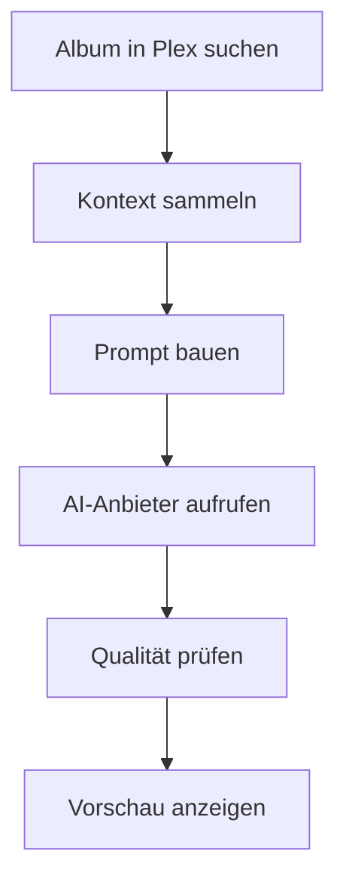
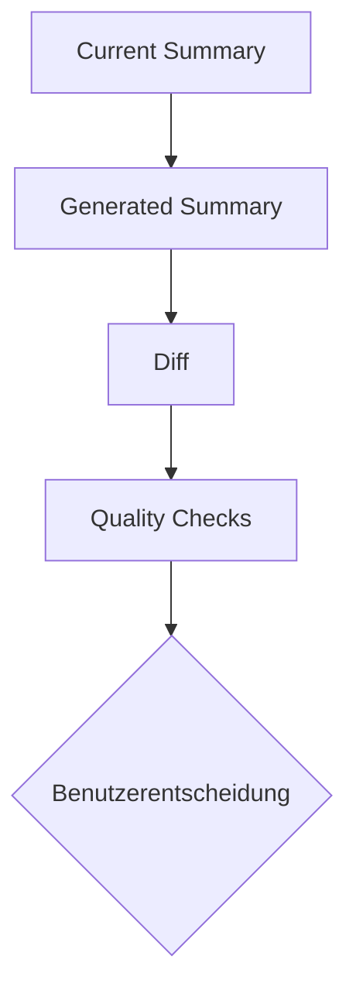
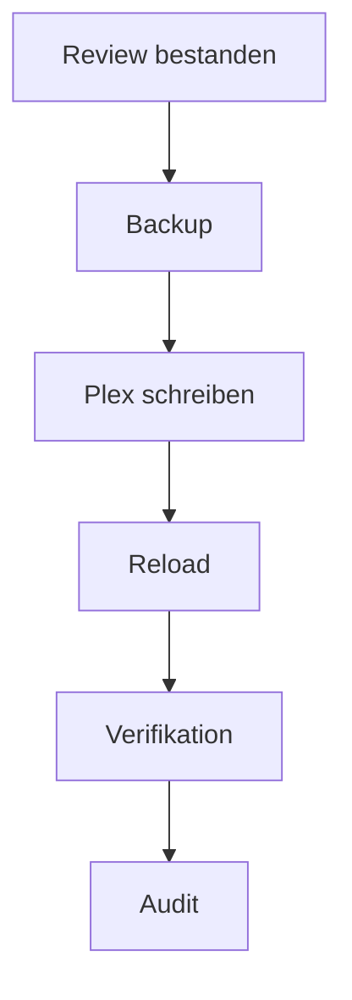

# 6. Workflows

Dieses Kapitel beschreibt komplette Arbeitsabläufe.

## 6.1 Einzelnes Album

```bash
plex-enhancer preview --artist "Jennifer Rush" --album "Credo"
plex-enhancer review --artist "Jennifer Rush" --album "Credo"
plex-enhancer apply --artist "Jennifer Rush" --album "Credo"
```

Empfehlung: Verwenden Sie zuerst `preview`, bevor Sie `apply` nutzen.

## 6.2 Einzelner Künstler

```bash
plex-enhancer preview artist --artist "Jennifer Rush"
plex-enhancer preview artist --artist "Jennifer Rush" --verbose
plex-enhancer preview artist --artist "Jennifer Rush" --save
plex-enhancer review artist --artist "Jennifer Rush"
plex-enhancer apply artist --artist "Jennifer Rush"
```

Die Künstler-Preview erzeugt eine längere deutsche Biografie mit Karriereüberblick, musikalischem
Stil und belegter Bedeutung. Mit `--verbose` sehen Sie Quellen, Faktenprüfung, Qualitätsbewertung
und Stilanalyse. Mit `--save` wird das vollständige Preview-Dokument unter
`exports/previews/artists/` gespeichert.

## 6.3 Ganze Bibliothek

```bash
plex-enhancer library plan --library "Music"
plex-enhancer library review --library "Music"
plex-enhancer library apply --library "Music"
plex-enhancer library report --library "Music" --export-json
```

## 6.4 Übersetzung

```bash
plex-enhancer preview --artist "Jennifer Rush" --album "Credo" --translate
plex-enhancer review --artist "Jennifer Rush" --album "Credo" --translate
```

Übersetzung nutzt den vorhandenen Plex-Text als Hauptquelle.

## 6.5 Verbesserung vorhandener deutscher Texte

```bash
plex-enhancer preview --artist "Jennifer Rush" --album "Credo" --improve
plex-enhancer review --artist "Jennifer Rush" --album "Credo" --improve
```

## 6.6 Preview Workflow



## 6.7 Review Workflow



## 6.8 Apply Workflow



## 6.9 Batch Processing

```bash
plex-enhancer batch review --library "Music" --missing-only --limit 50
```

Nutzen Sie Batch, wenn Sie mehrere Alben nacheinander prüfen möchten.

## 6.10 Library Mode

Der Library-Modus speichert Sitzungen und erlaubt das Fortsetzen.

```bash
plex-enhancer library resume --library "Music"
```

## 6.11 Qualitätssicherung

Vor Apply prüft das System:

- Sprache
- Länge
- Markdown
- Bullet-Listen
- offene Template- oder Testtexte
- Stil
- Faktenabdeckung

## 6.12 Rollback-Strategie

v1.0 speichert Backups vor Apply. Ein automatischer Rollback-Befehl ist nicht der Hauptworkflow. Wenn Sie zurücksetzen müssen, nutzen Sie die Backup-Datei unter `/config/exports/backups/` als Quelle.

## 6.13 Best Practices

- Kleine Testläufe vor großen Bibliotheken.
- Cache nicht unnötig löschen.
- `--verbose` bei unklaren Quellen verwenden.
- JSON-Exporte bei Fehlern aufbewahren.
- Review nie überspringen, wenn der Stil neu eingerichtet wurde.
