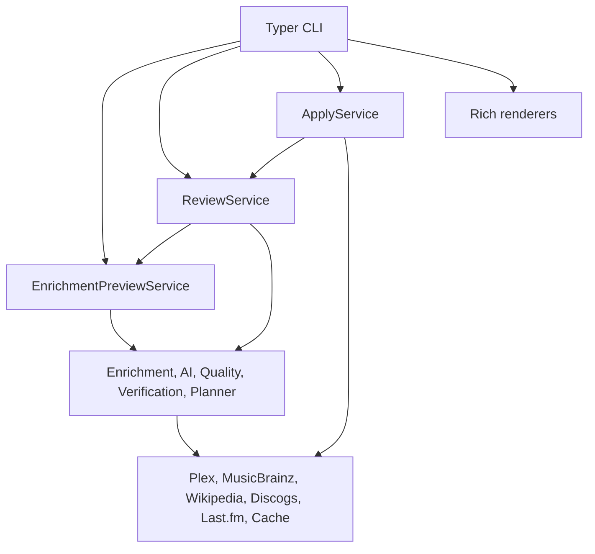
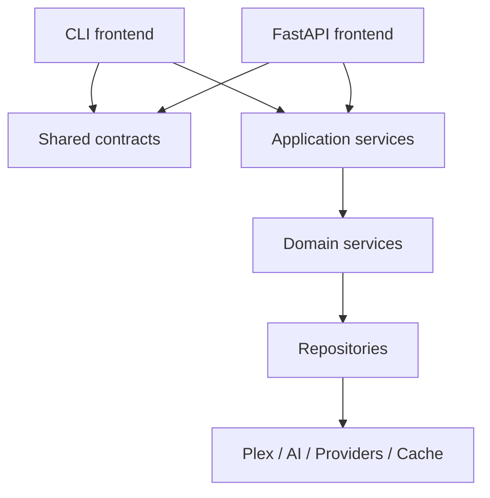

# Web Architecture

This document describes the architecture for the optional FastAPI backend and
the first React web interface. The UI is a desktop-oriented REST client. It does
not contain business logic and does not duplicate the Python workflows.

## Current Architecture

The project already has a useful service split:



The CLI remains the stable terminal frontend. The web interface is an additional
frontend that consumes the same REST API documents.

## Target Architecture

Both CLI and Web call the same application services through stable contracts:



Frontend responsibilities:

- read and validate user input
- call application services
- render results
- map errors to frontend-specific responses

Service responsibilities:

- orchestrate business workflows
- return typed documents
- avoid Typer, Rich, terminal prompts, and console output

Renderer responsibilities:

- format already-computed documents
- avoid generating business decisions

Repository responsibilities:

- encapsulate Plex, provider, cache, database, and filesystem access

## New Preparation Layer

The package `plex_music_enhancer.contracts` contains frontend-neutral Pydantic
models that can be used by both CLI and future FastAPI adapters:

- `ReviewRequest`
- `ReviewResponse`
- `PreviewDocumentContract`
- `ReviewDocumentContract`
- `QualityReportContract`
- `VerificationReportContract`
- `PromptAnalysisContract`
- `ApplyResultContract`
- `ConfigurationContract`
- `LibraryEntryContract`

These contracts are intentionally additive. Existing CLI models remain
unchanged for backwards compatibility.

The package `plex_music_enhancer.web` provides the FastAPI surface:

- `api/` for FastAPI adapters
- `schemas/` for web-specific schema adapters
- `contracts/` for web-facing contract adapters
- `static/` for packaged static assets
- `frontend/` for package-adjacent frontend notes

The repository-level `web/` directory contains the React source:

```text
web/
    src/
        api/
        components/
        hooks/
        layouts/
        pages/
        stores/
        styles/
        types/
        utils/
    public/
```

The production build is emitted to `src/plex_music_enhancer/web/static/` and is
served by the same FastAPI process as `/api/v1/...`.

## Configuration Service

`ConfigurationService` provides a sanitized configuration snapshot without
secrets. This prepares later UI diagnostics and avoids spreading direct
`Settings()` access into new frontends.

Current direct configuration access should remain stable. Future work should
prefer injecting `ConfigurationService` into frontend or API adapters.

## Coupling Audit

The following areas are still coupled to frontend concerns and should be
reviewed before implementing FastAPI:

| Area | Current coupling | Suggested future direction |
| --- | --- | --- |
| `cli.py` | Typer, Rich, service construction, error handling, JSON export, confirmation prompts | Keep as CLI adapter; move reusable orchestration into application services only when duplicated by Web |
| `review/debug.py` | Captures Rich renderer output and computes prompt diagnostics | Split analysis models from plain-text log rendering when API needs structured debug output |
| `review/renderer.py` | Rich-only rendering | Keep renderer-only; do not add decisions here |
| CLI preview render helpers | Rich table formatting mixed with JSON export decisions | Keep short term; later move export shape to contracts |
| Batch/library flows | Interactive callbacks and service orchestration are close together | Introduce request/response documents before Web batch workflows |
| Config access | Many commands instantiate `Settings()` directly | Gradually route UI diagnostics through `ConfigurationService` |

## Review Document Consolidation

The current review workflow already carries most information needed by a web
client:

- current summary
- generated summary
- unified diff
- quality validation
- editorial QA
- style diagnostics
- verification metrics
- prompt budget
- prompt decisions
- prompt quality
- prompt efficiency
- prompt utilization
- editorial coverage
- evidence coverage
- evidence ranking
- debug metadata

Some of these values are currently stored directly on `ReviewDocument`, while
others are computed by `ReviewDebugLogger` from `RenderedPrompt` diagnostics and
generated text.

Future consolidation should introduce a single structured review analysis model
that can be rendered as:

- Rich terminal output
- debug log text
- JSON export
- API response

No consolidation is performed in this step to avoid breaking existing tests and
CLI JSON output.

## Candidate API Services

The following services can later map cleanly to API endpoints:

- `EnrichmentPreviewService`: preview album and artist summaries
- `ReviewService`: create and update review documents
- `ApplyService`: apply approved summaries safely
- `ConfigurationService`: expose sanitized runtime configuration
- `KnowledgeCacheService`: list, clear, and summarize cache entries
- Library services: plan, review, apply, resume, and report library jobs
- Provider services: expose provider availability and diagnostics

## Risks

- API responses may accidentally mirror CLI-specific JSON instead of stable
  contracts.
- Review/debug analysis may diverge if terminal renderers continue computing
  data independently.
- Long-running library operations need progress and cancellation semantics
  before becoming HTTP workflows.
- Apply endpoints must preserve the current review-first safety policy.
- Configuration endpoints must never expose secrets.

## Roadmap

### Phase 1: Architecture

- add shared contracts
- document boundaries
- introduce `ConfigurationService`
- keep CLI behavior unchanged

### Phase 2: API Contracts

- map preview, review, apply, cache, and library services to contract outputs
- extract structured review analysis from debug rendering
- add service-level error models

This phase is prepared by the internal backend API described in
`docs/backend-api.md`.

### Phase 3: FastAPI

Completed: HTTP adapters around application services, OpenAPI generation,
dependency injection, central exception handling, and CLI start command.

### Phase 4: REST Endpoints

Completed for system, config, providers, statistics, logs, review, preview, and
apply. Library, artists, and albums namespaces are prepared for future
service-backed list endpoints.

### Phase 5: React

Completed as a first version: desktop shell, dashboard, artists, albums,
review, prompt debug, settings, central API client, TanStack Query state, Monaco
viewer/diff integration, tests, and FastAPI static serving.

### Phase 6: Desktop App

- package the web frontend only after the REST API and browser UI are stable
- keep desktop-specific behavior outside application services
