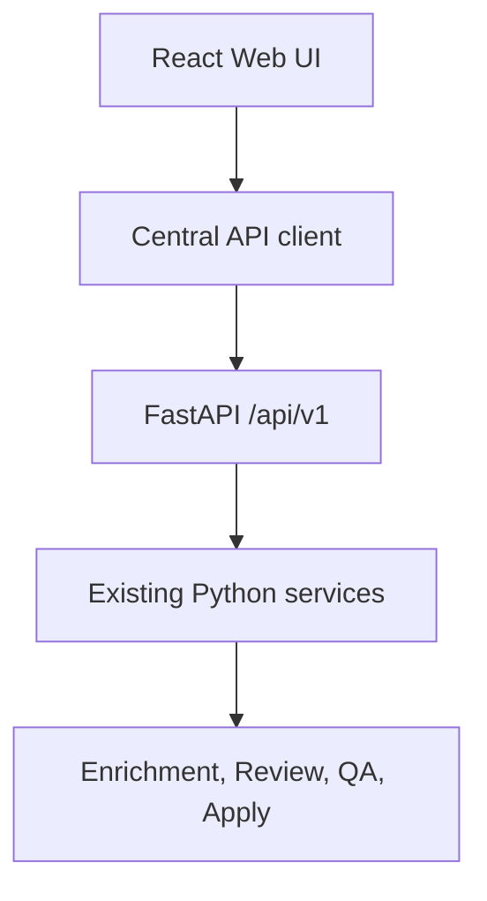

# Weboberfläche

Die Weboberfläche ist eine moderne Desktop-Ansicht für Plex Music Enhancer. Sie
wird vom gleichen FastAPI-Prozess ausgeliefert wie die REST-API und enthält
keine eigene Geschäftslogik.

## Start

```bash
python -m pip install ".[web]"
plex-enhancer serve
```

Standardmäßig läuft der Server unter:

```text
http://127.0.0.1:8080/
```

Der Port kann mit `--port` oder `PLEX_ENHANCER_WEB__PORT` geändert werden.
Docker- und Synology-Setups können später beispielsweise Host-Port `1008` auf
Container-Port `8080` mappen.

Nach erfolgreichem Start zeigt die CLI die Weboberfläche und die REST-API
getrennt an:

```text
✔ Web Interface
http://127.0.0.1:8080
✔ REST API
http://127.0.0.1:8080/api/v1/docs
```

## Architektur



Das Frontend verwendet:

- React
- TypeScript
- Vite
- React Router
- TanStack Query
- Mantine
- Monaco Editor
- Monaco Diff Editor

Alle Daten kommen aus der REST-API. Die Review-Seite rendert das bestehende
`ReviewDocument` mit QA, Editorial, Verification, Prompt Decisions, Prompt
Quality, Prompt Efficiency, Prompt Utilization, Evidence Coverage, Editorial
Coverage, Missed Opportunities und Prompt Budget.

## Navigation

Die erste Weboberfläche ist desktop-first aufgebaut:

- Dashboard: Systemstatus, Bibliotheksmetriken und Provider-Überblick
- Künstler: Arbeitsliste mit Suche, Filter, Sortierung, Mehrfachauswahl und Kontextaktionen
- Alben: Arbeitsliste mit Suche, Filter, Sortierung, Mehrfachauswahl und Kontextaktionen
- Reviews: zentrale Review-Ansicht mit aktueller und generierter Beschreibung
- Prompt Debug: `/tmp/openai_prompt.txt`, Prompt-Metadaten und Review-Log
- Live Log: aktualisierte Debug-Ausgaben mit Level-Filter und Suche
- Developer: Explain View, Prompt Decisions und technische Diagnose
- REST Explorer: vorhandene REST-Endpunkte mit Request, Response, Status und Laufzeit
- Einstellungen: Konfiguration und Provider-Status

Die Topbar enthält globale Suche, Command Palette (`Ctrl+K`), Provider-Auswahl,
Developer-Mode-Schalter, Theme-Schalter und Systemstatus. Der Developer Mode
blendet zusätzliche Analysebereiche ein, ändert aber keine Backend-Logik.

UI-Zustände wie Developer Mode und Review-Panelgröße werden lokal im Browser
gespeichert.

Rechts befindet sich ein Activity Panel. Es zeigt laufende Statusinformationen,
letzte Review-Debugdaten, Providerhinweise, Fehler- und Warnzustände auf Basis
der vorhandenen REST-Endpunkte.

## Review-Seite

Die Review-Seite ist die wichtigste Arbeitsfläche. Sie zeigt:

- Plex-Kontext mit Künstler, Album, Provider und Modell
- aktuelle Plex-Beschreibung
- neu generierte Beschreibung
- Monaco Diff Editor
- verschiebbaren Split zwischen aktueller und neuer Beschreibung
- QA-, Editorial- und Verification-Zusammenfassung
- rechte Analyseleiste mit Prompt Efficiency, Prompt Budget und Token-Nutzung
- Explain View mit backendseitig berechneten Entscheidungen

Alle Review-Aktionen laufen über die FastAPI-Endpunkte und verwenden dieselben
Services wie die CLI. Die Weboberfläche schreibt keine Metadaten direkt nach
Plex.

Ein Klick auf `Review` in der Künstler- oder Albumliste öffnet die Review-IDE im
Hauptbereich und startet den bestehenden Review-Endpunkt. Nach einem Apply zeigt
die Oberfläche einen Toast an.

## Prompt Debug und Developer Mode

Prompt Debug liest strukturierte Debug-Endpunkte:

| Bereich | Quelle |
| --- | --- |
| Prompt | `/api/v1/debug/prompt` |
| Prompt Meta | `/api/v1/debug/meta` |
| Review Log | `/api/v1/debug/review` |
| Explain View | `/api/v1/debug/explain` |
| Developer Doctor | `/api/v1/debug/doctor` |

Die Seite bietet Kopieren, Download und Aktualisieren der Debugdaten. Die
Developer-Seite fasst die wichtigsten Diagnosen für Issues und Prompt-Arbeit
zusammen.

Der REST Explorer ist ein Developer-Mode-Werkzeug. Er listet bekannte
öffentliche Endpunkte auf und zeigt Request, Response, HTTP-Status und
Antwortzeit. Er führt keine eigenen Workflows aus, sondern ruft ausschließlich
die vorhandene REST-API auf.

## Entwicklung

```bash
cd web
npm install
npm test
npm run build
```

Der Build wird nach `src/plex_music_enhancer/web/static/` geschrieben. Danach
liefert `plex-enhancer serve` die Weboberfläche und die REST-API aus einem
Prozess.

## Roadmap v2

- Batch Reviews
- Live Prompt Editor
- Prompt-Vergleich
- Verlauf aller Reviews
- Undo/Redo
- Versionierung
- Hintergrundjobs
- Fortschrittsanzeige
- Live-Logs
- Benutzerverwaltung
- Plugin-System
- Mehrsprachige Oberfläche
