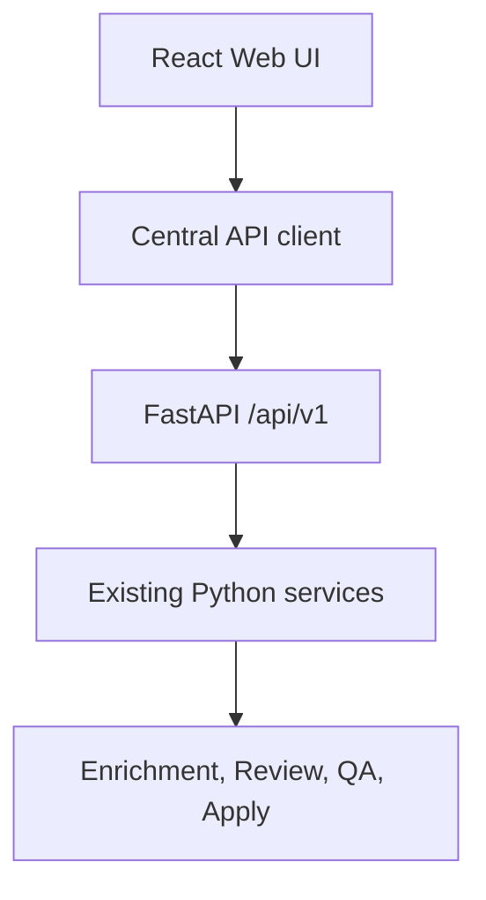

# Weboberfläche

Die Weboberfläche ist eine moderne Desktop-Ansicht für Plex Music Enhancer. Sie
wird vom gleichen FastAPI-Prozess ausgeliefert wie die REST-API und enthält
keine eigene Geschäftslogik.

## Start

```bash
python -m pip install ".[web]"
plex-enhancer serve
```

Standardmäßig läuft der Server unter:

```text
http://127.0.0.1:1008/
```

Der Port kann mit `--port` oder `PLEX_ENHANCER_WEB__PORT` geändert werden.

## Architektur



Das Frontend verwendet:

- React
- TypeScript
- Vite
- React Router
- TanStack Query
- Mantine
- Monaco Editor
- Monaco Diff Editor

Alle Daten kommen aus der REST-API. Die Review-Seite rendert das bestehende
`ReviewDocument` mit QA, Editorial, Verification, Prompt Decisions, Prompt
Quality, Prompt Efficiency, Prompt Utilization, Evidence Coverage, Editorial
Coverage, Missed Opportunities und Prompt Budget.

## Entwicklung

```bash
cd web
npm install
npm test
npm run build
```

Der Build wird nach `src/plex_music_enhancer/web/static/` geschrieben. Danach
liefert `plex-enhancer serve` die Weboberfläche und die REST-API aus einem
Prozess.

## Screenshots

Platzhalter für v1.1:

- Dashboard
- Review-Ansicht
- Prompt Debug
- Einstellungen

## Roadmap v2

- Batch Reviews
- Live Prompt Editor
- Prompt-Vergleich
- Verlauf aller Reviews
- Undo/Redo
- Versionierung
- Hintergrundjobs
- Fortschrittsanzeige
- Live-Logs
- Benutzerverwaltung
- Plugin-System
- Mehrsprachige Oberfläche
